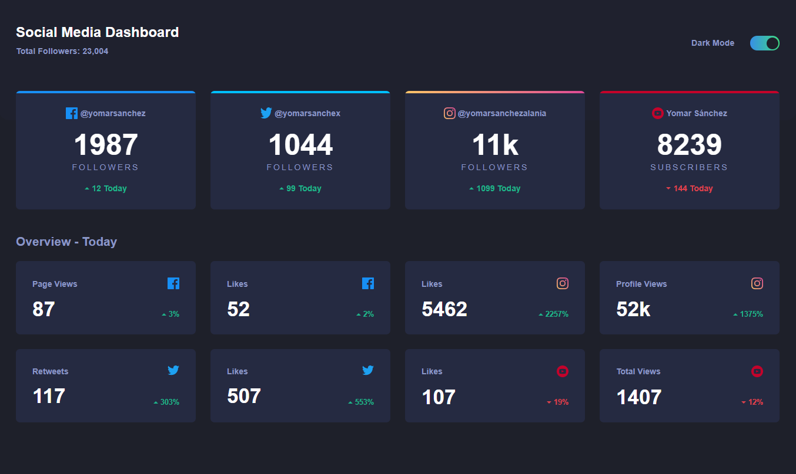

  
  

## Social Media Dashboard with ReactJs

Proyecto desarrollado gracias al **#LiveLiveCoding #2** en el canal de [**@LeonidasEsteban**](https://www.youtube.com/leonidasesteban). 
Demo https://yomarsanchez.github.io/social-media-dashboard

- **Video Youtube :** [Curso completo de React.js desde 0 con hooks](https://youtu.be/ScSHSI7TzRw).

### Resultado

#### Vista desktop

  

#### Vista mobile

  

## Available Scripts

In the project directory, you can run:

### `yarn start`

Runs the app in the development mode. 
Open [http://localhost:3000](http://localhost:3000) to view it in the browser.

### `yarn build`

Builds the app for production to the `build` folder. 

### License

The project is open-sourced software licensed under the [MIT license](https://opensource.org/licenses/MIT).
